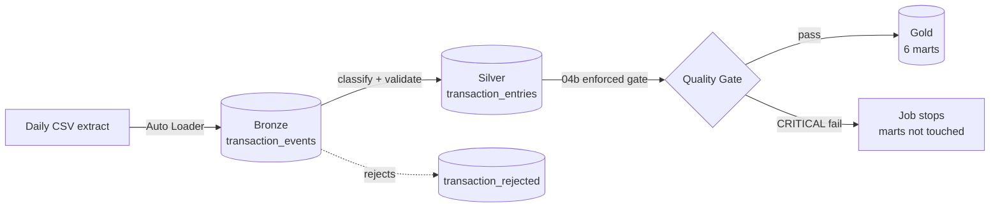

# NG Banking Transaction Lakehouse Pipeline

**A production-shaped Databricks lakehouse pipeline that ingests, classifies, quality-gates,
and aggregates core-banking transaction data — built to mirror the realities of a Flexcube-style
Nigerian retail bank's transaction feed (channels, lending, trade finance, treasury, payments,
and compliance monitoring) rather than a toy dataset with three columns.**


> 💡 **In plain terms:** this pipeline takes a raw daily transaction extract from a core banking
> system (the kind of file a bank's MIS/regulatory reporting team receives every day), figures out
> what each transaction actually *means* (a loan disbursement? a SWIFT payment? a POS purchase?),
> checks that the numbers add up correctly, and rolls everything up into ready-to-query summary
> tables — automatically, every day, with a built-in circuit breaker that stops the pipeline
> rather than publish bad numbers if something upstream breaks.

---

## Why this project exists

Enterprise reporting teams at banks spend a disproportionate amount of time on two problems:
**"what does this transaction code actually mean?"** and **"can I trust this number?"** This
pipeline is a self-contained, runnable answer to both — a reference-driven classification engine
plus an enforced data-quality gate, built on the medallion architecture (Bronze → Silver → Gold)
that Databricks recommends for lakehouse workloads.

It's designed around the column shapes, sign conventions, and edge cases (schema drift, malformed
amounts, unmapped product codes) that actually show up in a Temenos/Flexcube-style core banking
export — not a simplified stand-in for one.

## Architecture



Full diagrams (medallion layer detail + task DAG) and the reasoning behind each design choice are
in [`docs/ARCHITECTURE.md`](docs/ARCHITECTURE.md). Column-level detail is in
[`docs/DATA_DICTIONARY.md`](docs/DATA_DICTIONARY.md).

## Key engineering decisions

> 💡 **In plain terms:** each of these is a place where the "obvious" simple approach breaks in
> production, and what this pipeline does instead.

- **Classification is a reference table, not `if/elif` code.** `transaction_mapping` drives every
  `TRN_CODE` / `MODULE` / `PRODUCT` → business-category decision, with an explicit precedence order
  (most-specific match wins) and a `PRIORITY` tiebreaker. Adding coverage for a new loan product or
  SWIFT message type is a table `INSERT`, not a redeploy.
- **A negative amount is not automatically a "reversal."** `IS_REVERSAL_CANDIDATE` requires both a
  negative source amount *and* a verified reversal code in the mapping table — a rule the
  enforced quality gate (`REVERSAL_CANDIDATE_WITHOUT_VERIFIED_CODE`) actively protects against
  regressing.
- **Data quality is enforced, not just visualized.** `04b_transaction_quality_gate.py` runs six
  CRITICAL integrity checks (duplicate keys, sign/abs/net consistency, unverified reversals) and
  **fails the Databricks task** if any of them breach zero — the mart-building task never runs on
  data that failed the gate. A companion SQL notebook still exists for ad hoc/dashboard profiling,
  but the pipeline's correctness doesn't depend on a human reading it.
- **Incremental everywhere.** The Silver transform only processes rows ingested since the last
  watermark; each Gold mart only rebuilds the exact dates/months touched by the current run. Cost
  stays flat as history accumulates instead of growing with total table size.
- **Idempotent by construction.** Auto Loader's checkpoint prevents double-ingesting a file; the
  Silver `MERGE` is keyed on a hash of the natural transaction key with a "latest update wins"
  rule; each mart deletes-then-appends its own affected slice. Re-running any notebook after a
  partial failure is always safe.
- **Compliance-aware by default.** A sixth mart (`aml_exception_activity`) surfaces both
  source-flagged AML exceptions and a configurable high-value threshold breach, aggregated by
  date/branch/currency — the kind of monitoring view a bank's financial-crime team would actually
  ask for.
- **File lifecycle is managed, not left to accumulate.** Each source file moves
  `incoming/` → `processed/` the moment it's durably ingested (a move failure here is a WARNING,
  never a pipeline failure, since the data's already safely committed). A separate **weekly** job
  then sweeps `processed/` into `archive/YYYY/MM/DD/`, dated by each file's own timestamp rather
  than the archive run date — housekeeping is decoupled from the daily critical path entirely.
- **No secrets in notebooks.** Any credential a notebook needs (e.g. a failure-alert webhook) is
  retrieved via `dbutils.secrets.get()` at the point of use, never hardcoded or logged.

## Tech stack

| Layer | Tools |
|---|---|
| Ingestion | Databricks Auto Loader, PySpark Structured Streaming, schema-evolution rescue |
| Storage | Delta Lake, Unity Catalog (3-level namespace: catalog.schema.table) |
| Transform | PySpark (window functions for precedence matching & dedup), parameterized notebooks |
| Data quality | Programmatic SQL checks with a pass/fail gate, results logged to a Delta table for trend analysis |
| Orchestration | Databricks Workflows via Databricks Asset Bundles (IaC — one command deploys the daily pipeline job and a separate weekly archive job, with retries and failure alerts) |
| Testing | `pytest` unit tests on the core business-rule logic (sign, absolute value, net amount, classification precedence, reversal detection) |
| Reference data generation | Python/pandas synthetic data generator producing realistic TRN_CODE/PRODUCT/MODULE distributions across 10+ banking business lines |

## Repository structure

```
ng_banking_transaction_lakehouse_pipeline/
├── databricks.yml                  # Asset Bundle: dev/staging/prod targets
├── resources/
│   ├── pipeline_job.yml            # Daily job: task DAG, retries, schedule, alerts
│   └── archive_job.yml             # Weekly job: processed/ -> archive/YYYY/MM/DD/
├── notebooks/
│   ├── 00_pipeline_config.py       # Shared config, widgets, structured logging
│   ├── 00b_setup_volume_structure.py  # One-time (idempotent): creates incoming/processed/archive/etc.
│   ├── 01_transaction_ingestion.py # Bronze: Auto Loader + move to processed/
│   ├── 02_transaction_raw_validation.sql  # Bronze profiling (read-only)
│   ├── 03_transaction_incremental_transform.py  # Silver: classify, validate, merge
│   ├── 04_transaction_quality_checks.sql  # DQ profiling (dashboard-friendly)
│   ├── 04b_transaction_quality_gate.py    # DQ ENFORCEMENT (fails the job)
│   ├── 05_transaction_mart.py      # Gold: 6 incremental marts
│   └── 06_archive_processed_files.py  # Weekly: processed/ -> dated archive/
├── sql/                             # DDL, reference-data seeding, validation queries
├── reference/transaction_mapping_seed.csv  # The classification reference table
├── tests/test_transform_rules.py   # pytest — business rules, no Spark cluster needed
├── docs/{ARCHITECTURE,DATA_DICTIONARY}.md
└── workflows/pipeline_tasks.md
```

## Getting started

One-time setup, in order (these are SQL scripts and a setup notebook — not part of either
scheduled job, since they only need to run once per catalog):

```sql
-- 1. Create the catalog, schemas, and all 11 tables
-- run sql/01_create_tables.sql

-- 2. Seed the classification reference table
-- run sql/02_seed_reference.sql
```

```bash
# 3. Create the Volume's folder structure (incoming/, processed/, archive/, etc.)
# — run notebooks/00b_setup_volume_structure.py once, idempotent to re-run

# 4. Deploy both jobs: the daily pipeline and the weekly archive sweep
databricks bundle deploy -t dev

# 5. Drop a CSV extract into transaction_files/incoming/, then run the daily pipeline
databricks bundle run ng_banking_transaction_lakehouse_pipeline -t dev

# The weekly archive job runs on its own schedule (Sundays 03:00) once deployed —
# trigger it manually any time with:
databricks bundle run ng_banking_transaction_archive -t dev
```

Or run each notebook manually in order — see [`workflows/pipeline_tasks.md`](workflows/pipeline_tasks.md).

**Environments:** `databricks.yml` defines `dev`/`staging`/`prod` targets so the bundle *can*
isolate environments via a per-target `catalog` variable override — but as currently configured,
all three targets share one physical catalog (`ng_banking_lakehouse`), since only that catalog has
been provisioned so far. To get real isolation later, create a second catalog with steps 1-3 above
under a different name and add a `variables: catalog: <name>` override back onto that target.

## Testing

```bash
pytest tests/test_transform_rules.py -v
```

Ten unit tests cover the sign convention, absolute/net amount derivation, the
negative-amount-is-not-automatically-a-reversal rule, and the classification precedence
ordering — all without needing a Spark cluster, so they run in CI in milliseconds.

## Synthetic data

No real customer data is used or required. `generate_transactions.py` (companion script,
not included in this package) produces a configurable, schema-matched synthetic extract
spanning every business line the reference mapping supports — retail channels, funds
transfer, lending, trade finance, treasury, interest/charges, accounting, securities,
standing instructions, payments, remittance, SWIFT, and cheque processing.

---

## About the author

**Wealth Arubayi** — Business Intelligence Analyst, Enterprise Reporting, Ecobank Nigeria.

Day to day, this looks like: staging MIS and regulatory reporting data on SAP BusinessObjects'
Universe layer, writing Web Intelligence reports, managing UAT-to-Production promotions, and
building Delta Lake / PySpark pipelines on Azure Databricks with Unity Catalog governance —
against Oracle Flexcube and SQL Server Finacle core banking systems.

This project is a self-directed engineering exercise built to demonstrate that same skill set —
lakehouse pipeline design, reference-driven data classification, enforced data quality, and
infrastructure-as-code deployment — outside the constraints of a single employer's codebase.
The patterns here (medallion architecture, idempotent incremental processing, Unity Catalog
governance, tested business logic) are deliberately generic to data engineering and BI, not
specific to banking.

- ITIL v4 Foundation certified
- [ORCID iD](https://orcid.org) on file
- Core stack: SAP BusinessObjects (Universe Designer & Web Intelligence), Azure Databricks
  (Delta Lake, PySpark, Unity Catalog), SQL (Oracle & SQL Server), Figma

Open to Business Intelligence and Data Engineering roles across industries.
