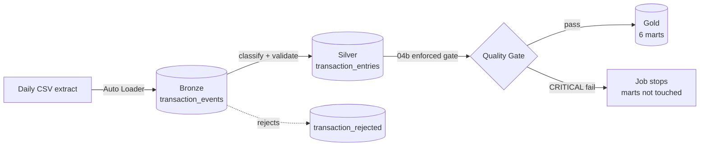

# NG Banking Transaction Lakehouse Pipeline

**A production-shaped Databricks lakehouse pipeline that ingests, classifies, quality-gates,
and aggregates core-banking transaction data — built to mirror the realities of a Flexcube-style
Nigerian retail bank's transaction feed (channels, lending, trade finance, treasury, payments,
and compliance monitoring) rather than a toy dataset with three columns.**


> 💡 **In plain terms:** this pipeline takes a raw daily transaction extract from a core banking
> system (the kind of file a bank's MIS/regulatory reporting team receives every day), figures out
> what each transaction actually *means* (a loan disbursement? a SWIFT payment? a POS purchase?),
> checks that the numbers add up correctly, and rolls everything up into ready-to-query summary
> tables — automatically, every day, with a built-in circuit breaker that stops the pipeline
> rather than publish bad numbers if something upstream breaks.

---

## Why this project exists

Enterprise reporting teams at banks spend a disproportionate amount of time on two problems:
**"what does this transaction code actually mean?"** and **"can I trust this number?"** This
pipeline is a self-contained, runnable answer to both — a reference-driven classification engine
plus an enforced data-quality gate, built on the medallion architecture (Bronze → Silver → Gold)
that Databricks recommends for lakehouse workloads.

It's designed around the column shapes, sign conventions, and edge cases (schema drift, malformed
amounts, unmapped product codes) that actually show up in a Temenos/Flexcube-style core banking
export — not a simplified stand-in for one.

## Architecture



Full diagrams (medallion layer detail + task DAG) and the reasoning behind each design choice are
in [`docs/ARCHITECTURE.md`](docs/ARCHITECTURE.md). Column-level detail is in
[`docs/DATA_DICTIONARY.md`](docs/DATA_DICTIONARY.md).

## Tables

The pipeline creates 14 tables across three schemas in Unity Catalog (`ng_banking_lakehouse`).
Key columns are listed below; full column-level descriptions are in
[`docs/DATA_DICTIONARY.md`](docs/DATA_DICTIONARY.md).

### Bronze — `transaction_raw` (1 table)

**`transaction_events`** (67 cols, all `string`) — raw CSV landed as-is by Auto Loader, plus ingestion metadata.

| Key column | Type | Description |
|---|---|---|
| `TRN_REF_NO` | string | Transaction reference number |
| `AC_NO` | string | Account number |
| `TRN_CODE` | string | Transaction code (e.g. F23, T10) |
| `MODULE` | string | Banking module (e.g. DE, FT, CL) |
| `DRCR_IND` | string | Debit/credit indicator (C or D) |
| `LCY_AMOUNT` | string | Local currency amount (raw) |
| `AC_ENTRY_SR_NO` | string | Account entry serial number (8B+ range) |
| `AML_EXCEPTION` | string | AML flag (Y or empty) |
| `RELATED_ACCOUNT` | string | Related account number (float-formatted in source) |
| `RELATED_CUSTOMER` | string | Related customer number (float-formatted in source) |
| `RAW_INGEST_TIMESTAMP` | timestamp | Auto Loader ingestion time |
| `SOURCE_FILE_NAME` | string | Source CSV file name |

### Silver — `transaction_curated` (7 tables)

**`transaction_entries`** (83 cols) — typed, classified, validated transaction records. The pipeline's primary Silver table.

| Key column | Type | Description |
|---|---|---|
| `TRANSACTION_KEY` | string | SHA-256 hash of TRN_REF_NO + EVENT_SR_NO + AC_ENTRY_SR_NO (MERGE key) |
| `TRANSACTION_DIRECTION` | string | CREDIT or DEBIT (derived from DRCR_IND) |
| `ABS_LCY_AMOUNT` | decimal(20,3) | Absolute LCY amount magnitude |
| `NET_SIGNED_AMOUNT` | decimal(20,3) | Credit-positive / debit-negative signed amount |
| `IS_NEGATIVE_AMOUNT` | boolean | True if SOURCE_LCY_AMOUNT < 0 |
| `IS_REVERSAL_CANDIDATE` | boolean | True if negative AND verified reversal code |
| `AC_ENTRY_SR_NO` | bigint | Account entry serial number (8B+ range, widened from int) |
| `TRANSACTION_CATEGORY` | string | Business category from mapping (TRANSFER, DEPOSIT, LOAN, etc.) |
| `TRANSACTION_DESCRIPTION` | string | Human-readable description from mapping |
| `MAP_MODULE` | string | Mapped module (UNMAPPED if no match) |
| `CLASSIFICATION_STATUS` | string | Match level (MAPPED_TRN_MODULE_PRODUCT → UNMAPPED) |
| `RELATED_ACCOUNT` | string | Clean account number (`.0` suffix stripped) |
| `RELATED_CUSTOMER` | string | Clean customer number (`.0` suffix stripped) |
| `AML_EXCEPTION` | string | AML flag passed through from source |

**`transaction_mapping`** (40 rows, 11 cols) — classification reference table driving TRN_CODE/MODULE/PRODUCT → category mapping.

| Column | Type | Description |
|---|---|---|
| `TRN_CODE` | string | Transaction code (null = wildcard match) |
| `MODULE` | string | Banking module (null = wildcard match) |
| `PRODUCT` | string | Product (null = wildcard match) |
| `PRIORITY` | int | Tiebreaker (higher wins) |
| `TRANSACTION_CATEGORY` | string | Business category (TRANSFER, DEPOSIT, LOAN, TRADE_FINANCE, etc.) |
| `TRANSACTION_DESCRIPTION` | string | Human-readable description |
| `IS_REVERSAL_CODE` | boolean | Marks verified reversal codes |
| `ACTIVE_FLAG` | string | Y = active mapping |

**`transaction_rejected`** (13 cols) — rows that failed validation, with rejection reason.

| Column | Type | Description |
|---|---|---|
| `TRANSACTION_KEY` | string | Hash of the rejected transaction |
| `REJECTION_REASON` | string | MISSING_TRANSACTION_REFERENCE, MISSING_ACCOUNT, INVALID_DATE, etc. |
| `REJECTED_TIMESTAMP` | timestamp | When the row was rejected |

**`pipeline_dq_results`** (7 cols) — DQ check results logged every run for trend tracking.

| Column | Type | Description |
|---|---|---|
| `CHECK_NAME` | string | e.g. DUPLICATE_TRANSACTION_KEY, EMPTY_GRP_REF_NO_PCT |
| `SEVERITY` | string | CRITICAL or WARN |
| `RESULT_VALUE` | double | Measured value (count or percentage) |
| `PASSED` | boolean | True if check passed |

**`etl_watermark`** (3 cols) — incremental processing watermark.

| Column | Type | Description |
|---|---|---|
| `PIPELINE_NAME` | string | Pipeline identifier |
| `LAST_RAW_INGEST_TIMESTAMP` | timestamp | Only rows newer than this are processed |
| `LAST_RUN_TIMESTAMP` | timestamp | When the watermark was last updated |

**`pipeline_processing_log`** (12 cols) — per-run audit trail.

**`pipeline_affected_dates`** (7 cols) — dates/months touched by each run, scoped to mart rebuilds.

### Gold — `transaction_mart` (6 tables)

**`daily_transaction_activity`** (26 cols) — grain: date × branch × currency.

| Key column | Type | Description |
|---|---|---|
| `TRANSACTION_DATE` | date | Transaction date |
| `AC_BRANCH` | string | Branch code |
| `AC_CCY` | string | Currency |
| `TRANSACTION_COUNT` | bigint | Total transactions |
| `TOTAL_CREDIT_AMOUNT` | decimal(38,3) | Sum of credit amounts |
| `TOTAL_DEBIT_AMOUNT` | decimal(38,3) | Sum of debit amounts |
| `NET_TRANSACTION_AMOUNT` | decimal(38,3) | Net (credit - debit) |
| `UNIQUE_TRANSACTION_CATEGORIES` | bigint | Distinct TRANSACTION_CATEGORY values |

**`account_transaction_activity`** (25 cols) — grain: account × month.

| Key column | Type | Description |
|---|---|---|
| `AC_NO` | string | Account number |
| `RELATED_CUSTOMER` | string | Customer number (clean, no `.0`) |
| `TRANSACTION_MONTH_ID` | int | YYYYMM format |
| `ACTIVE_TRANSACTION_DAYS` | bigint | Distinct transaction dates |
| `UNIQUE_TRANSACTION_CATEGORIES` | bigint | Distinct categories |

**`branch_transaction_activity`** (20 cols) — grain: date × branch.

**`transaction_code_activity`** (22 cols) — grain: date × TRN_CODE × category × module × currency.

| Key column | Type | Description |
|---|---|---|
| `TRN_CODE` | string | Transaction code |
| `TRANSACTION_CATEGORY` | string | Business category from curated |
| `MODULE` | string | Source module |
| `MAP_MODULE` | string | Mapped module |
| `AC_CCY` | string | Currency |

**`transaction_category_activity`** (19 cols) — grain: date × category × affiliate × currency.

| Key column | Type | Description |
|---|---|---|
| `TRANSACTION_CATEGORY` | string | Business category (TRANSFER, DEPOSIT, etc.) |
| `TRANSACTION_COUNT` | bigint | Total transactions in this category |
| `UNIQUE_ACCOUNT_COUNT` | bigint | Distinct accounts |
| `UNIQUE_BRANCH_COUNT` | bigint | Distinct branches |

**`aml_exception_activity`** (13 cols) — grain: date × branch × currency. AML and high-value monitoring.

| Key column | Type | Description |
|---|---|---|
| `AML_FLAGGED_COUNT` | bigint | Source-flagged AML exceptions |
| `HIGH_VALUE_COUNT` | bigint | Transactions exceeding HIGH_VALUE_THRESHOLD_LCY |
| `HIGH_VALUE_THRESHOLD_LCY` | decimal(20,3) | Configured threshold (5,000,000) |
| `TOTAL_EXCEPTION_AMOUNT` | decimal(38,3) | Total value of flagged transactions |

## Key engineering decisions

> 💡 **In plain terms:** each of these is a place where the "obvious" simple approach breaks in
> production, and what this pipeline does instead.

- **Classification is a reference table, not `if/elif` code.** `transaction_mapping` drives every
  `TRN_CODE` / `MODULE` / `PRODUCT` → business-category decision, with an explicit precedence order
  (most-specific match wins) and a `PRIORITY` tiebreaker. Adding coverage for a new loan product or
  SWIFT message type is a table `INSERT`, not a redeploy.
- **A negative amount is not automatically a "reversal."** `IS_REVERSAL_CANDIDATE` requires both a
  negative source amount *and* a verified reversal code in the mapping table — a rule the
  enforced quality gate (`REVERSAL_CANDIDATE_WITHOUT_VERIFIED_CODE`) actively protects against
  regressing.
- **Data quality is enforced, not just visualized.** `04b_transaction_quality_gate.py` runs six
  CRITICAL integrity checks (duplicate keys, sign/abs/net consistency, unverified reversals) and
  **fails the Databricks task** if any of them breach zero — the mart-building task never runs on
  data that failed the gate. Four additional WARN checks track source-column completeness
  (population % for columns that are currently 100% empty in the feed) to `pipeline_dq_results`
  for trend monitoring without blocking the pipeline. A companion SQL notebook still exists for ad
  hoc/dashboard profiling, but the pipeline's correctness doesn't depend on a human reading it.
- **Incremental everywhere.** The Silver transform only processes rows ingested since the last
  watermark; each Gold mart only rebuilds the exact dates/months touched by the current run. Cost
  stays flat as history accumulates instead of growing with total table size.
- **Idempotent by construction.** Auto Loader's checkpoint prevents double-ingesting a file; the
  Silver `MERGE` is keyed on a hash of the natural transaction key with a "latest update wins"
  rule; each mart deletes-then-appends its own affected slice. Re-running any notebook after a
  partial failure is always safe.
- **Compliance-aware by default.** A sixth mart (`aml_exception_activity`) surfaces both
  source-flagged AML exceptions and a configurable high-value threshold breach, aggregated by
  date/branch/currency — the kind of monitoring view a bank's financial-crime team would actually
  ask for.
- **File lifecycle is managed, not left to accumulate.** Each source file moves
  `incoming/` → `processed/` the moment it's durably ingested (a move failure here is a WARNING,
  never a pipeline failure, since the data's already safely committed). A separate **weekly** job
  then sweeps `processed/` into `archive/YYYY/MM/DD/`, dated by each file's own timestamp rather
  than the archive run date — housekeeping is decoupled from the daily critical path entirely.
- **No secrets in notebooks.** Any credential a notebook needs (e.g. a failure-alert webhook) is
  retrieved via `dbutils.secrets.get()` at the point of use, never hardcoded or logged.
- **Type widening for large serial numbers.** `AC_ENTRY_SR_NO` values exceed int32 max
  (8.0B–8.6B range); the Silver cast uses `long`/`bigint` via Delta type widening, not
  `int` — which silently returned NULL for all 50,000 rows before the fix.
- **Source data formatting cleanup.** `RELATED_ACCOUNT` and `RELATED_CUSTOMER` arrive
  from the CSV as float strings (e.g. `"5276612194.0"`); the transform strips the
  trailing `.0` so downstream joins and lookups match cleanly.
- **Source completeness monitoring.** Four columns (`RELATED_AC_ENTRY_SR_NO`,
  `GRP_REF_NO`, `GLMIS_UPDATE_FLAG`, `ORIG_PNL_GL`) are present in the raw schema but
  100% empty in the source feed. WARN-level DQ checks log their population % to
  `pipeline_dq_results` every run, so a sudden change (either direction) is
  immediately visible in the trend — without blocking the pipeline.

## Tech stack

| Layer | Tools |
|---|---|
| Ingestion | Databricks Auto Loader, PySpark Structured Streaming, schema-evolution rescue |
| Storage | Delta Lake, Unity Catalog (3-level namespace: catalog.schema.table) |
| Transform | PySpark (window functions for precedence matching & dedup), parameterized notebooks |
| Data quality | Programmatic SQL checks with a pass/fail gate, results logged to a Delta table for trend analysis |
| Orchestration | Databricks Workflows via Databricks Asset Bundles (IaC — one command deploys the daily pipeline job and a separate weekly archive job, with retries and failure alerts) |
| Testing | `pytest` unit tests on the core business-rule logic (sign, absolute value, net amount, classification precedence, reversal detection) |
| Reference data generation | Python/pandas synthetic data generator producing realistic TRN_CODE/PRODUCT/MODULE distributions across 10+ banking business lines |

## Repository structure

```
ng_banking_transaction_lakehouse_pipeline/
├── databricks.yml                  # Asset Bundle: dev/staging/prod targets
├── resources/
│   ├── pipeline_job.yml            # Daily job: task DAG, retries, schedule, alerts
│   └── archive_job.yml             # Weekly job: processed/ -> archive/YYYY/MM/DD/
├── notebooks/
│   ├── 00_pipeline_config.py       # Shared config, widgets, structured logging
│   ├── 00b_setup_volume_structure.py  # One-time (idempotent): creates incoming/processed/archive/etc.
│   ├── 01_transaction_ingestion.py # Bronze: Auto Loader + move to processed/
│   ├── 02_transaction_raw_validation.sql  # Bronze profiling (read-only)
│   ├── 03_transaction_incremental_transform.py  # Silver: classify, validate, merge
│   ├── 04_transaction_quality_checks.sql  # DQ profiling (dashboard-friendly)
│   ├── 04b_transaction_quality_gate.py    # DQ ENFORCEMENT (fails the job)
│   ├── 05_transaction_mart.py      # Gold: 6 incremental marts
│   ├── 06_archive_processed_files.py  # Weekly: processed/ -> dated archive/
│   ├── 07_pipeline_success_notification.py  # Post-success email notification
│   └── Pipeline Reset and Backfill.py  # One-off: truncate + re-run after schema fixes
├── scripts/
│   └── check_undeployed.sh          # Detect changes not yet deployed via DABs
├── sql/                             # DDL, reference-data seeding, validation queries
├── reference/transaction_mapping_seed.csv  # The classification reference table
├── tests/test_transform_rules.py   # pytest — business rules, no Spark cluster needed
├── docs/{ARCHITECTURE,DATA_DICTIONARY}.md
└── workflows/pipeline_tasks.md
```

## Deployment

### Prerequisites

- A Databricks workspace with Unity Catalog enabled and a running (or startable) all-purpose
  cluster — the daily and weekly jobs each provision their own lightweight single-node job cluster,
  so no shared cluster needs to be pre-created.
- The [Databricks CLI](https://docs.databricks.com/en/dev-tools/cli/install.html) installed
  locally, authenticated to your workspace (`databricks configure` or `databricks auth login`).
- The project pushed to a Git repository — needed either way: for the CLI path it's just good
  practice, for the Bundle UI path (below) it's required.

### One-time setup (per catalog, not part of either scheduled job)

Run these once, in order, in a SQL editor / notebook attached to your workspace:

1. **`sql/01_create_tables.sql`** — creates the catalog, all 3 schemas
   (`transaction_raw`/`curated`/`mart`), and all 11 tables. Idempotent — safe to re-run.
2. **`notebooks/00b_setup_volume_structure.py`** — creates the Volume's folder structure
   (`incoming/`, `processed/`, `archive/`, Auto Loader's `schema/`/`checkpoints/`) and copies
   `reference/transaction_mapping_seed.csv` into the Volume. Also idempotent.
3. **`sql/02_seed_reference.sql`** — loads the classification mapping table via `COPY INTO`,
   reading the file `00b` just placed in the Volume.

Alternatively, all three steps are wrapped as a single on-demand (unscheduled) Databricks
Job — see [`resources/setup_job.yml`](resources/setup_job.yml) — that you can trigger instead of
running each step by hand: `databricks bundle run ng_banking_transaction_setup -t dev`.

### Deploy and run

```bash
# 1. Set your workspace host in databricks.yml (each target: workspace: host: ...)

# 2. Validate the bundle before touching anything (free — no workspace changes)
databricks bundle validate -t dev

# 3. Deploy: creates both Databricks Workflows — the daily pipeline and the weekly archive sweep
databricks bundle deploy -t dev

# 4. Drop a CSV extract into the Volume, then run the daily pipeline
databricks bundle run ng_banking_transaction_lakehouse_pipeline -t dev

# The weekly archive job runs on its own schedule (Sundays 03:00) once deployed —
# trigger it manually any time with:
databricks bundle run ng_banking_transaction_archive -t dev
```

`-t dev` is the target; swap for `-t staging` or `-t prod` per `databricks.yml`. `dev` is marked
`default: true`, so it's used automatically if `-t` is omitted.

Prefer no automation at all? Every notebook can also be run manually, top to bottom, in order —
see [`workflows/pipeline_tasks.md`](workflows/pipeline_tasks.md) for the manual sequence and what
each task depends on.

### Alternative: no CLI, deploy from the browser

If `databricks.yml` lives inside a **Git folder** in your workspace (Workspace → Repos/Git
folders → Add repo), Databricks recognizes it as a bundle automatically: open `databricks.yml`,
click the deployments icon, pick a target, and **Deploy** — no local CLI needed. This also works
from a cluster's **Web Terminal**, if enabled, using the same `databricks bundle` commands as
above (auth there is automatic, tied to your workspace session).

### Environments

`databricks.yml` defines `dev`/`staging`/`prod` targets so the bundle *can* isolate environments
via a per-target `catalog` variable override — but as currently configured, all three targets
share one physical catalog (`ng_banking_lakehouse`), since only that catalog has been provisioned
so far. To get real isolation later, run the one-time setup above under a second catalog name and
add a `variables: catalog: <name>` override back onto that target.

### Tracking undeployed changes

`scripts/check_undeployed.sh` detects code changes that haven't reached the workspace
via a DABs deploy yet — useful before a release or as a CI gate. It checks three layers:

1. **Git** — uncommitted edits and unpushed commits (code not even in the repo yet)
2. **Bundle** — `databricks bundle validate` (is the config structurally deployable?)
3. **Drift** — files modified after the last deployment timestamp marker

```bash
# Check for undeployed changes (default target: dev)
./scripts/check_undeployed.sh

# Check a specific target
./scripts/check_undeployed.sh -t staging

# Skip bundle validation for a faster Git-only check
./scripts/check_undeployed.sh --skip-validate
```

After each successful deploy, stamp the marker so the drift check has a baseline:

```bash
databricks bundle deploy -t dev
date -u +%Y-%m-%dT%H:%M:%SZ > .last_deploy_dev
```

Exit codes: `0` = clean, `1` = undeployed changes found, `2` = error. This makes the
script suitable as a pre-deploy CI gate:

```yaml
# .github/workflows/deploy-gate.yml (excerpt)
- name: Check for undeployed changes
  run: ./scripts/check_undeployed.sh -t prod
  continue-on-error: false  # fails the pipeline if changes are undeployed
```

### A path-resolution detail worth knowing

Task paths inside a `resources/*.yml` file (e.g. `notebook_path: ../notebooks/01_...py`) are
resolved **relative to that YAML file's own folder**, not the bundle root — this is current,
documented Databricks Asset Bundle behavior, not a workaround. Since every file under
`resources/` sits one level below `notebooks/` and `sql/`, every reference in this project starts
with `../`. If you add a new task pointing at a notebook, keep that in mind — `./notebooks/...`
from inside `resources/` silently resolves to a folder that doesn't exist, and `databricks bundle
validate` won't necessarily catch it in every case.

## Testing

```bash
pytest tests/test_transform_rules.py -v
```

Ten unit tests cover the sign convention, absolute/net amount derivation, the
negative-amount-is-not-automatically-a-reversal rule, and the classification precedence
ordering — all without needing a Spark cluster, so they run in CI in milliseconds.

## Synthetic data

No real customer data is used or required. `generate_transactions.py` (companion script,
not included in this package) produces a configurable, schema-matched synthetic extract
spanning every business line the reference mapping supports — retail channels, funds
transfer, lending, trade finance, treasury, interest/charges, accounting, securities,
standing instructions, payments, remittance, SWIFT, and cheque processing.

---

## Changelog

### 2026-09-27 — Transform fixes & DQ enhancements

**Bug fixes in `03_transaction_incremental_transform`:**

- **`TRANSACTION_CATEGORY` & `TRANSACTION_DESCRIPTION`** were computed by the mapping
  join but missing from the `outcols` list — the MERGE wrote NULL for every row. Added
  both columns to `outcols`; the mapping table (40 active rows) now populates them
  correctly (TRANSFER, DEPOSIT, LOAN, TRADE_FINANCE, etc.).
- **`AC_ENTRY_SR_NO`** was cast as `try_cast(... as int)`, but source values range
  8.0B–8.6B — all exceed int32 max (2.1B), so every row became NULL. Changed the cast
  to `long` and widened the curated table column from `int` to `bigint` via Delta type
  widening (`delta.enableTypeWidening`). All 50,000 rows now populate correctly.
- **`RELATED_ACCOUNT` & `RELATED_CUSTOMER`** arrived from the source CSV as float
  strings (e.g. `"5276612194.0"`). Added `regexp_replace(col, r'\.0$', '')` to strip
  the trailing `.0` so IDs are clean integers.

**Data quality enhancements:**

- **Notebook 04** — added SQL profiling cell reporting population % for four columns
  that are 100% empty in the source feed (`RELATED_AC_ENTRY_SR_NO`, `GRP_REF_NO`,
  `GLMIS_UPDATE_FLAG`, `ORIG_PNL_GL`).
- **Notebook 04b** — added four WARN-level checks
  (`EMPTY_RELATED_AC_ENTRY_SR_NO_PCT`, `EMPTY_GRP_REF_NO_PCT`,
  `EMPTY_GLMIS_UPDATE_FLAG_PCT`, `EMPTY_ORIG_PNL_GL_PCT`) that log population % to
  `pipeline_dq_results` every run for trend tracking.

**Pipeline operations:**

- Created `Pipeline Reset and Backfill` notebook to refresh curated + mart tables
  after the schema fixes. Required because `AC_ENTRY_SR_NO` is part of the
  `TRANSACTION_KEY` hash — old keys (NULL from int overflow) differ from new keys
  (real values), so a full refresh was needed to avoid duplicate rows.

**Deployment tooling:**

- Added `scripts/check_undeployed.sh` — detects Git-uncommitted, bundle-invalid, and
  post-deploy-drift changes before a release.

---

## About the author

**Wealth Arubayi** — Business Intelligence Analyst, Enterprise Reporting, Ecobank Nigeria.

Day to day, this looks like: staging MIS and regulatory reporting data on SAP BusinessObjects'
Universe layer, writing Web Intelligence reports, managing UAT-to-Production promotions, and
building Delta Lake / PySpark pipelines on Azure Databricks with Unity Catalog governance —
against Oracle Flexcube and SQL Server Finacle core banking systems.

This project is a self-directed engineering exercise built to demonstrate that same skill set —
lakehouse pipeline design, reference-driven data classification, enforced data quality, and
infrastructure-as-code deployment — outside the constraints of a single employer's codebase.
The patterns here (medallion architecture, idempotent incremental processing, Unity Catalog
governance, tested business logic) are deliberately generic to data engineering and BI, not
specific to banking.

- ITIL v4 Foundation certified
- [ORCID iD](https://orcid.org) on file
- Core stack: SAP BusinessObjects (Universe Designer & Web Intelligence), Azure Databricks
  (Delta Lake, PySpark, Unity Catalog), SQL (Oracle & SQL Server), Figma

Open to Business Intelligence and Data Engineering roles across industries.
