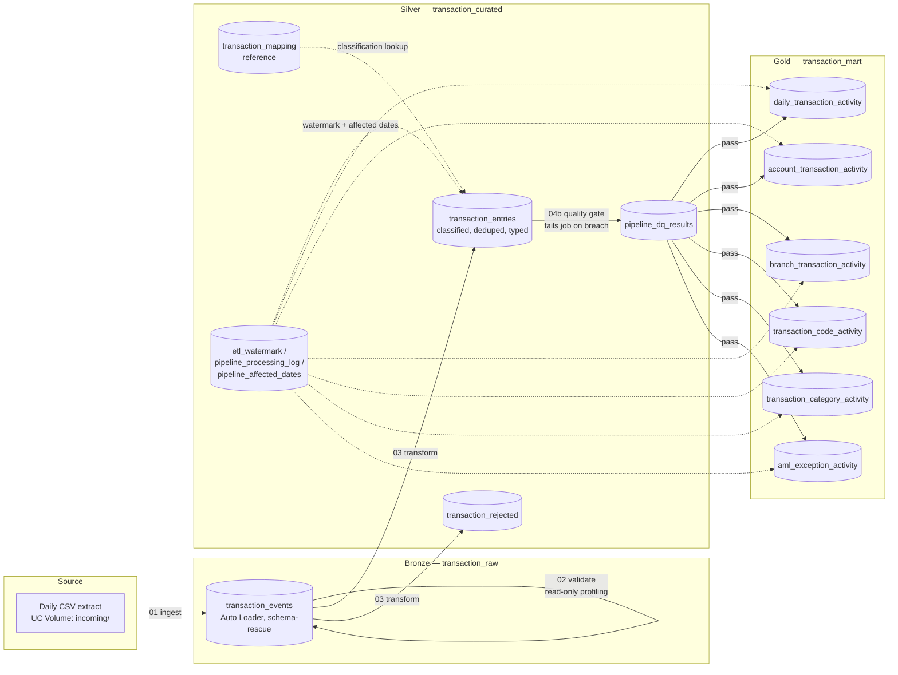
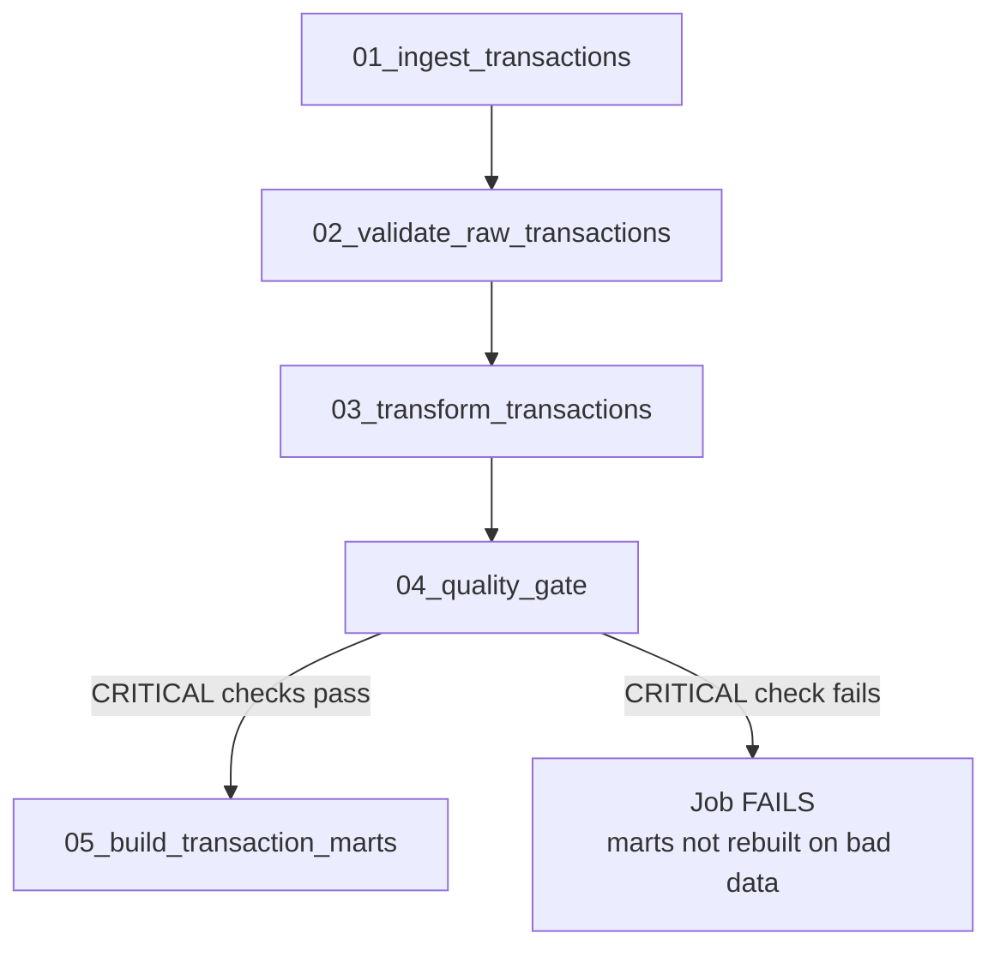

# Architecture

## Medallion layers

## Task DAG (Databricks Workflow)

## Why this shape

- **Auto Loader + schema rescue (Bronze):** new/unexpected source columns land in
  `_rescued_data` instead of failing the stream — the pipeline degrades gracefully
  when the core banking export changes shape, and nothing is silently dropped.
- **Incremental watermark, not full reprocessing (Silver):** `03_transaction_incremental_transform`
  only reads rows ingested since `etl_watermark.LAST_RAW_INGEST_TIMESTAMP`, so cost stays
  flat as history grows. Idempotency comes from the `MERGE ... ON TRANSACTION_KEY` with a
  "latest STREAM_UPDATE_TIMESTAMP wins" rule, not from "only run once."
- **Reference-driven classification, not hardcoded logic:** `transaction_mapping` decides
  what every `TRN_CODE`/`MODULE`/`PRODUCT` combination means, with an explicit precedence
  order. Extending coverage (a new loan product, a new SWIFT message type) is a table
  `INSERT`, not a code change or redeploy.
- **An enforced gate, not just a dashboard (04b):** the six CRITICAL checks
  (duplicate keys, sign/abs/net internal consistency, unverified reversal candidates)
  raise and fail the Databricks task if breached, which is what actually stops
  `05_build_transaction_marts` from running on bad data — a SELECT statement someone
  might not look at that day is not a control.
- **Affected-dates-only mart rebuilds (Gold):** each mart deletes and re-appends only the
  dates/months touched by the current run, so a 6-mart refresh is proportional to today's
  volume, not total history.
- **Config isolated in one notebook (`00_pipeline_config.py`):** table names, paths and the
  environment (`dev`/`staging`/`prod`) are set once via widgets and imported everywhere else
  with `%run`, so promoting the pipeline between environments is a parameter change, not a
  find-and-replace across five files.
